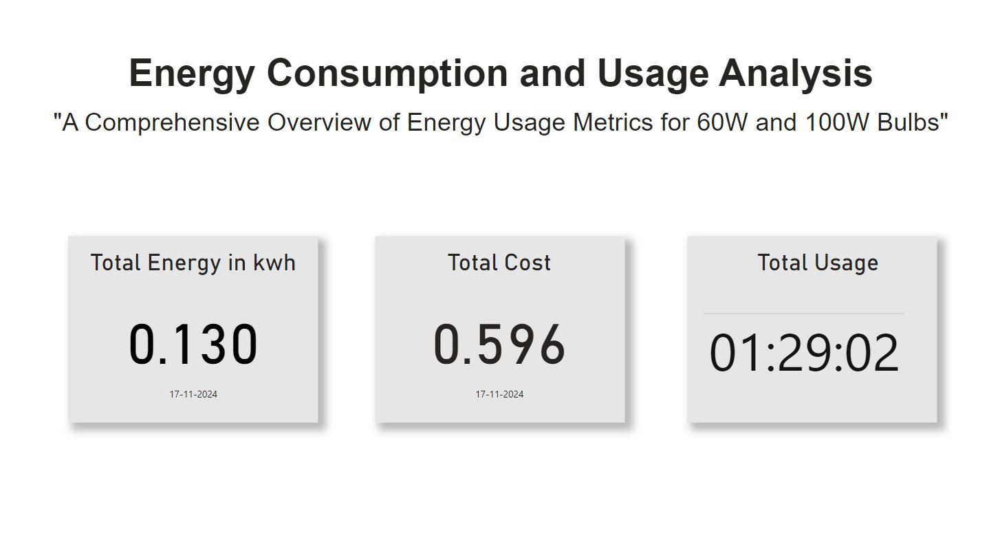
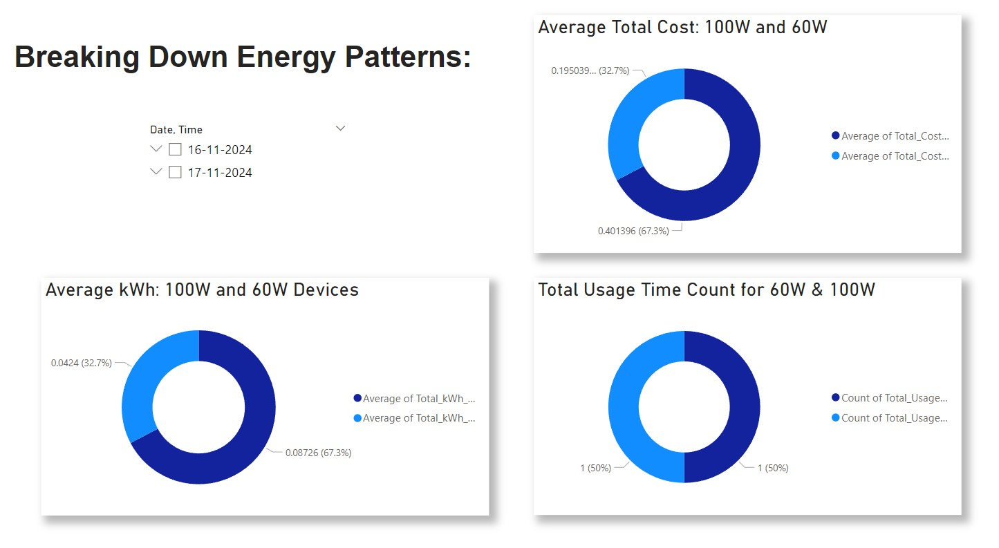
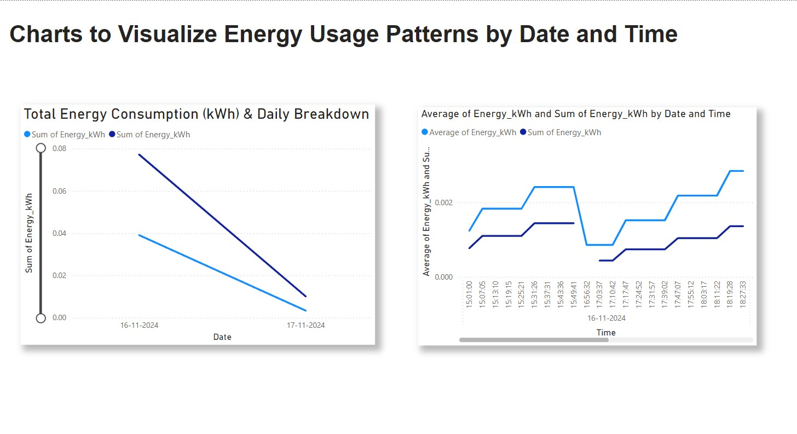
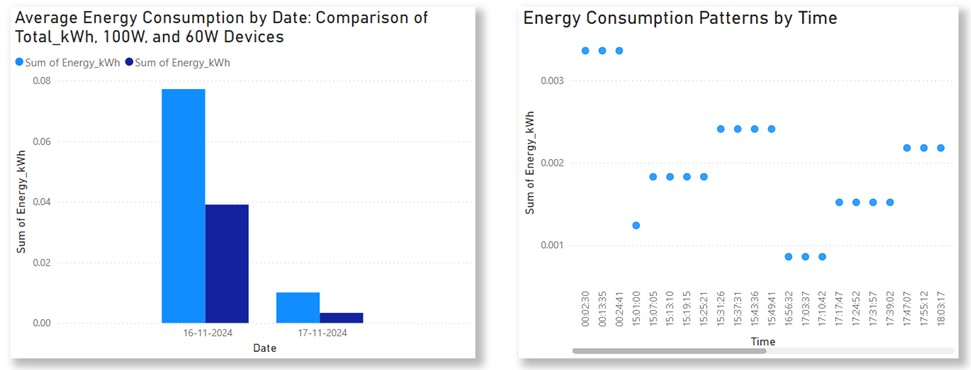
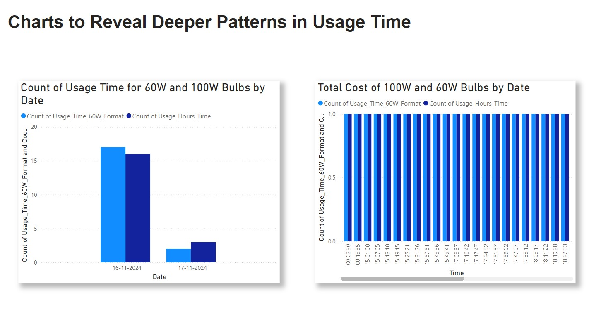
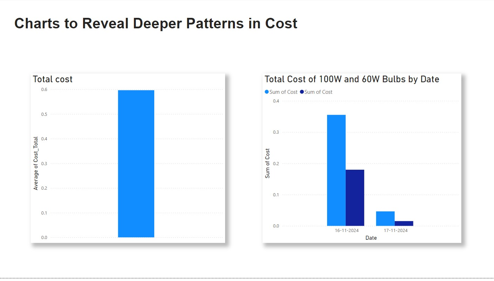

# IoT-Based Energy Consumption and Usage Analysis

An IoT project that monitors, analyzes, and helps optimize energy usage in real time. It measures voltage and current with sensors, stores the readings, and turns them into clear usage and cost insights.

## Overview

Energy waste often goes unnoticed because usage is rarely visible. This project collects live electrical data from appliances, estimates energy cost from usage, and presents patterns and saving tips in an easy-to-read dashboard.

## Key Features

- Real-time monitoring of energy usage
- Accurate cost estimation based on usage
- Appliance-wise usage patterns
- Insights and tips to reduce energy costs
- Easy-to-use dashboards for viewing data

## Hardware

- NodeMCU ESP32: collects and sends data
- ZMPT101B: voltage sensor
- ACS712: current sensor

## Software and Tools

- Data storage: CSV and Excel files
- Visualization: Power BI

## How It Works

1. The ESP32 reads voltage (ZMPT101B) and current (ACS712) values.
2. The readings are sent and stored in CSV and Excel files.
3. Power BI loads the data and shows usage, cost, and appliance patterns.
4. The dashboard provides insights to help reduce energy costs.

## Screenshots

### Energy Patterns

### Usage by Date and Time

### Energy by Date and Time

### Usage Time Analysis

### Cost Analysis

## Project Structure

Add the folder layout here after upload.

## Future Improvements

Add your planned improvements here.

## Author

Kaviya R ([GitHub](https://github.com/Kaviya0253))
